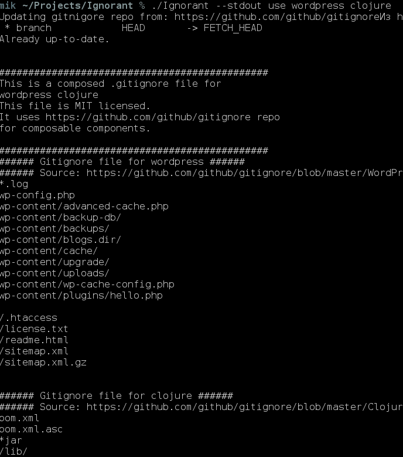

= Ignorant 

Easily compose many different .gitignore files into one

== Usage

=== Create gitignore

    ignorant use Clojure Leiningen WordPress

It will generate .gitignore file after
it fetches the last version of https://github.com/github/gitignore[gitignore]
Keep in mind, that all language/framework *names are lowercased* to be easily greppable
If you want to output your .gitignore file to stdout, please specify stdout option

    ignorant --stdout use Clojure Leiningen WordPress

=== Show possible languages/frameworks

    ignorant show
    ignorant show | grep clojure

Keep in mind, that all language/framework *names are lowercased* to be easily greppable

== Features

* Fetches last version of https://github.com/github/gitignore[gitignore], thus your *.gitignore* will be always updated.
* Supports over 203 common .gitignore files
* Supports easily grepable hints on what .gitignore languages/files are supported
* Supports composing many .gitignore files into one

== Installation

Ignorant uses Go toolchains, so I don't provide binaries.

    go get -u github.com/MichaelLeachim/ignorant

Make sure `$GOPATH/bin` is in your `$PATH`.

== TODO

* Make autocomplete
* Add fetching delay(every hour/every day)
* Make tests

== License

link:./LICENSE[The MIT License].

== Author

Michael Leachim <mklimoff222@gmail.com>
